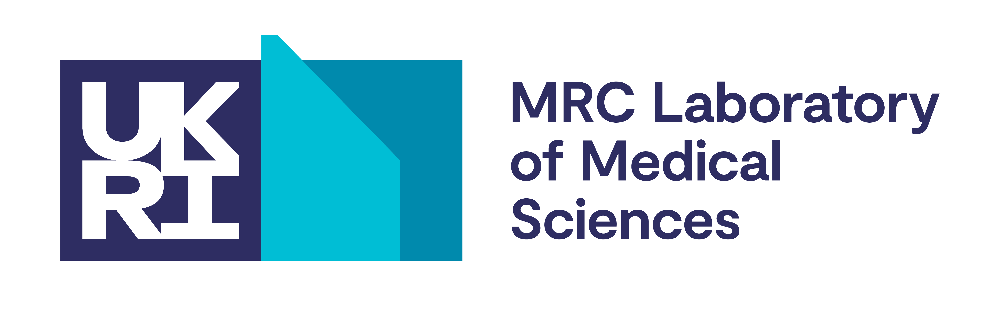

:octocat: Over 10 years of open science on GitHub
:microscope: Integrative advice and assistance with data analysis
:desktop_computer: High performance computing and pipeline development
:chart_with_upwards_trend: Software and database development
:mortar_board: Training and mentoring
